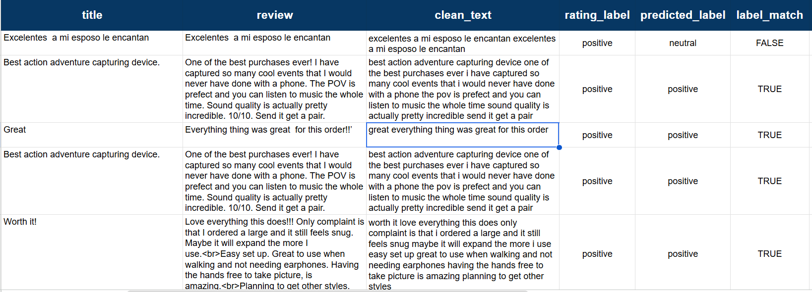
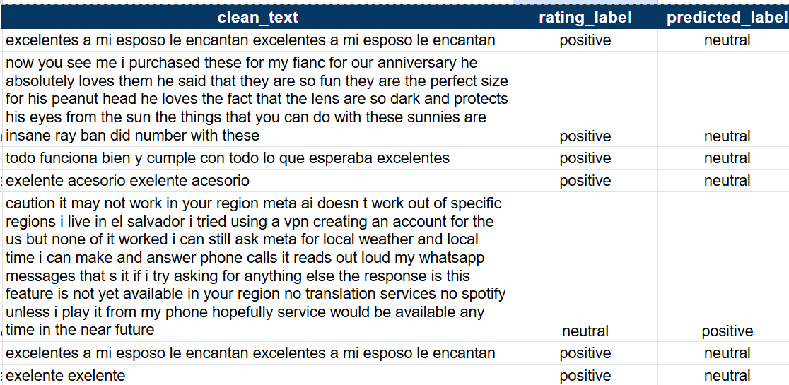
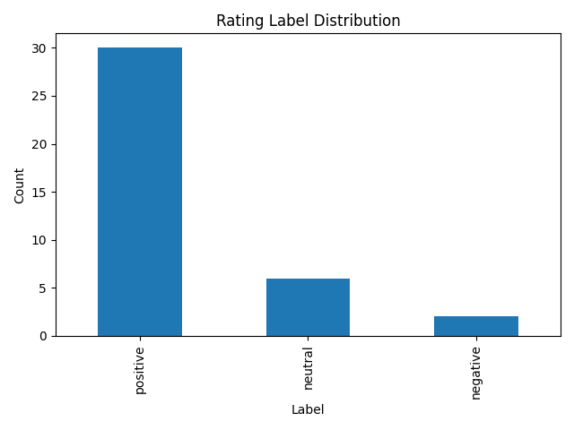
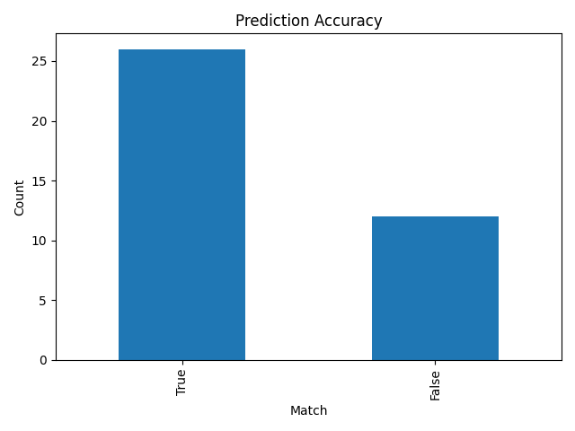

# 📊 AI-Assisted Sentiment Labeling Pipeline with Ground Truth Validation and Error Analysis
### 🚀 End-to-End AI Data Training & Evaluation Workflow


---

## 🎯 What This Project Does

- Builds an end-to-end **AI data training pipeline**  
- Generates **sentiment labels (rule-based + AI-based)**  
- Compares **AI predictions vs ground truth**  
- Identifies **model weaknesses**  
- Performs **error analysis & data quality checks**

---

## 🧭 Project Overview

This project replicates the real workflow of an **AI Data Trainer**.

From raw customer reviews → to final evaluation:

```text
Raw Data → Clean → Label → Predict → Compare → Analyze → Report
```

---

## 🖼️ Demo

### 🔹 Before → After → Result

```text
Before:
"The product is AMAZING!!! 😍😍 <br>"

After:
"the product is amazing"

rating_label: positive
predicted_label: positive

Result: Match ✅
```

---

### 🔹 Pipeline Output

<p align="center">
  
</p>

---

### 🔹 AI Mistake Example

<p align="center">
  
</p>

```text
Text:
"excelentes a mi esposo le encantan"

rating_label: positive
predicted_label: neutral

Result: Mismatch ❌
Reason: Non-English text
```

---

## 🛠️ Tech Stack

| Tool | Purpose |
|------|--------|
| 🐍 Python | Core programming |
| 📦 Pandas | Data processing |
| 🧠 TextBlob | Sentiment prediction |
| 💻 VS Code + Git Bash | Development |

---

## ⚙️ Pipeline Workflow

### 🧹 Data Processing
- Removed irrelevant columns  
- Combined `title + review`  
- Handled missing values  

### 🧼 Text Cleaning
- Removed HTML tags (`<br>`)  
- Removed noise (symbols, URLs)  
- Normalized text  

---

### 🧠 Sentiment Labeling

#### Ground Truth (Rating-Based)

| Rating | Label |
|--------|------|
| 4–5 | Positive |
| 3 | Neutral |
| 1–2 | Negative |

#### AI Prediction (TextBlob)

- Uses text polarity  
- Outputs: positive / neutral / negative  

---

### 🔍 Evaluation

```text
label_match = rating_label == predicted_label
```

---

### 📉 Error Analysis
- Extracted mismatched predictions  
- Identified failure patterns  
- Added mistake reasons  

---

### 🌍 Data Quality Check
- Detected non-English reviews  
- Flagged potential issues  

---

## 📊 Results

### 📈 Label Distribution

<p align="center">
  
</p>

> Most reviews are positive, indicating dataset imbalance.

---

### 📉 Prediction Accuracy

<p align="center">
  
</p>

> AI performs well overall but struggles with non-English and short text.

---

## 📊 Key Insight

```text
Text: excelentes a mi esposo le encantan
Rating: 5 (positive)
AI Prediction: neutral ❌
```

👉 Insight: Simple NLP models fail on **non-English + contextual sentiment**

---

## 💡 Key Learnings

- Data quality directly impacts AI performance  
- Non-English text reduces prediction accuracy  
- Rating-based labels act as reliable ground truth  
- Error analysis reveals real-world model limitations  

---

## 🎯 Skills Demonstrated

- 🧹 Data cleaning & preprocessing  
- 🏷️ Automated labeling  
- 🔍 AI evaluation  
- ⚠️ Error analysis  
- 📊 Dataset quality assessment  

---

## 📁 Project Structure

```text
ai-review-sentiment-pipeline/
│
├── data/ (datasets and outputs)
├── src/ (pipeline scripts)
├── assets/ (images and charts)
├── README.md
└── requirements.txt
```

---

## 🚀 How to Run

```bash
pip install -r requirements.txt
```

```bash
python src/01_load_and_select.py
python src/02_prepare_text.py
python src/03_clean_text.py
python src/04_create_labels.py
python src/05_compare_labels.py
python src/06_analyze_mistakes.py
python src/07_detect_language_issues.py
python src/08_export_reports.py
```

---

## 🏁 Final Result

This project delivers a complete, real-world simulation of an **AI data training and evaluation workflow**
---


## 📌 Author

**Nahian Bin Rahman**  
🔗 GitHub: https://github.com/nahian-binrahman  

---

⭐ If you found this project useful, consider giving it a star!
